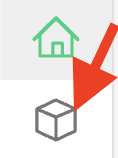

# Описание задания
Вам необходимо построить Proof of Concept семантического поиска с ответом от LLM (в простонародье RAG-систему)

Для этого необходимо:
1. Поднять векторную базу данных Milvus для хранения эмбеддингов текстов (инструкция внизу)
2. Найти подходяющую модель для векторизации текстов (**подробно** объяснить, почему выбрали именно ее)
3. Написать веб-сервер с инференсом модели (torchserve, rayserve, nvidia triton)
4. Завернуть его в Docker container (написать Dockerfile)
5. Придумать стратегию векторизации текстов. Описать логику алгоритма, почему сделали именно так. Описать потенциальные минусы (room for improvement). Описать идеальную стратегию, которую бы вы реализовали, если бы было много времени.
6. Написать скрипт процессинга текстов
   1. Векторизация текста через обращение в инференс модели
   2. Добавление полученных векторов и текстов в векторную БД Milvus
7. Написать поисковое приложение, которое будет
   1. Векторизовать запрос (обращаться в контейнер с инференсом модели)
   2. Получать наиболее релевантных кандидатов (обращаться в Milvus)
   3. Отправлять их как контекст в GigaChat (здесь можно поиграться с промптом модели, [быстрый старт](https://developers.sber.ru/docs/ru/gigachat/individuals-quickstart), [инструкция к API](https://developers.sber.ru/docs/ru/gigachat/api/reference/rest/gigachat-api))
   4. Выдавать ответ в формате 
   ```
    {
        "answer": <Ответ GigaChat>,
        "retrieved_text": List[str],
        "document_ids": List[str]
    }
   ```
8. Завернуть приложение в Docker container (написать Dockerfile)
9.  Протестировать приложение
   1. Подготовить инструкцию сборки и запуска всех компонентов и примеры обращения на Python
   2. Написать скрипт, который прочитает `queries.json`, обратится к контейнеру с приложением и запишет ответы в JSON `search_results.json` в формате
```json
   {
        [
            {
                "answer": <Ответ GigaChat на запрос 1>,
                "retrieved_text": List[str],
                "document_ids": List[str]
            },
            {
                "answer": <Ответ GigaChat на запрос 2>,
                "retrieved_text": List[str],
                "document_ids": List[str]
            },
            ...
        ]
   }
```
10. Написать список идей по улучшению/проблемы реализованной архитектуры поиска. (Что бы вы делали, если бы у вас было достаточно времени, явно написать, на что **конкретно** повлияет **конкретная** идея)
11. Оформить github репозиторий с инструкцией запуска, ответами на впоросы и решением задачи

Пожалуйста, пишите максимально чистый и понятный код, это позволит оценить ваши навыки программирования :)

В идеале все докеры и приложения должны работать на nvidia, явно укажите, если у вас нет карты nvidia, поэтому вы делали на cpu

# Milvus

## Развертывание Milvus через docker-compose

Milvus — это высокопроизводительная векторная база данных, которая позволяет хранить вектора и иные сопутствующие данные (скалярные величины, текстовые данные).

### Подготовка

Убедитесь, что `Docker` и `docker-compose` установлены на вашей машине. Вы можете проверить установку, выполнив следующие команды:

```shell
docker --version
docker-compose --version (старый способ)
docker compose version (новый способ)
```

Если Docker или docker-compose не установлены, следуйте официальной инструкции на сайте [Docker](https://docs.docker.com/get-docker/) и [docker-compose](https://docs.docker.com/compose/install/) для установки.

### Запуск Milvus

Для запуска Milvus выполните следующую команду в каталоге с файлом `docker-compose.yml`:

```shell
cd milvus-docker && docker-compose up -d
```

Эта команда запустит все необходимые контейнеры для Milvus.

### Проверка запуска Milvus

Проверьте запущенные контейнеры, используя команду:

```shell
docker-compose ps
```

## Инструкция по созданию коллекции и загрузке в нее векторов

Подробнее [тут](https://milvus.io/docs/manage-collections.md)

### Подключение к Milvus

Установите SDK Milvus для python:

```shell
pip install pymilvus==2.3.7
```

### Создание коллекции и поиск по ней

Пример [тут](https://milvus.io/docs/quickstart.md)

### UI для Milvus

1. Подключитесь через браузер к хосту `http://localhost:3000`
2. Нажмите кнопку `Connect`
3. Перейдите в коллекции в меню слева
4. Найдите свою коллекцию `example_collection`
5. Вы можете посмотреть на нее, кликнув на название
6. Для удаления коллекции отметьте ее галочкой и нажмите сверху `drop`
